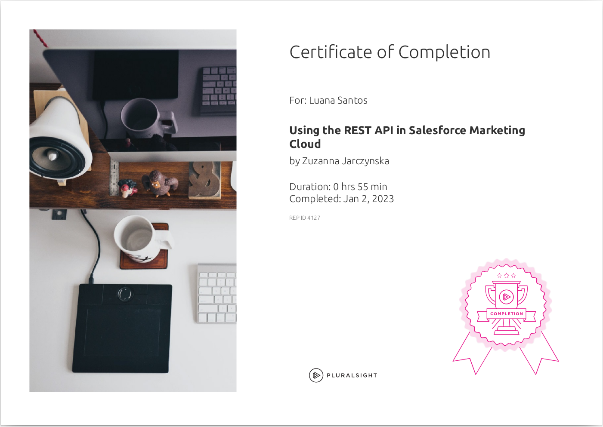

# Personal Development Index

This is a simple document that aims to list and index evidences of personal development. Read [this references](./docs/references.md) for aditional details.

 
<h1>Backlog</h1>
<ul>
  <li>
    
 
      

        <a href="https://www.totaltypescript.com/tutorials/beginners-typescript">[Tutorial] Beginners TypeScript</a> (0%)
      

      <ul>
        <li>
          Started: 
        </li>
        <li>
          Finished:
        </li>
      </ul>
      

  </li>
  <li>
    
 
      

        <a href="https://www.totaltypescript.com/tutorials/zod">[Tutorial] Zod</a> (0%)
      

      <ul>
        <li>
          Started: 
        </li>
        <li>
          Finished:
        </li>
      </ul>
      

  </li>
  <li>
    
 
      

        <a href="https://www.totaltypescript.com/workshops/type-transformations">[Workshop] Type Transformations</a> (0%)
      

      <ul>
        <li>
          Started: 
        </li>
        <li>
          Finished:
        </li>
      </ul>
      

  </li>
  <li>
    
 
      

        <a href="https://www.totaltypescript.com/tips">[Workshop] TypeScript Tips</a> (0%)
      

      <ul>
        <li>
          Started: 
        </li>
        <li>
          Finished:
        </li>
      </ul>
      

  </li>
  <li>
    
 
      

        <a href="https://hasura.io/learn/">[Tutorial] FullStack GraphQL Tutorials</a> (0%)
      

      <ul>
        <li>
          Started: 
        </li>
        <li>
          Finished:
        </li>
      </ul>
      

  </li>
  <li>
    
 
      

        <a href="https://www.amazon.com.br/Peopleware-Productive-Projects-Tom-DeMarco/dp/0321934113">[Book] Peopleware: Productive Projects and Teams</a> (0%)
      

      <ul>
        <li>
          Started: 
        </li>
        <li>
          Finished:
        </li>
      </ul>
      

  </li>
  <li>
    
 
    

      <a href="https://github.com/amaralc/learn-threejs-using-react">[Course] Learn ThreeJS using React</a> (0%)
    

    <ul>
        <li>
          Started: 
        </li>
        <li>
          Finished:
        </li>
      </ul>
    

  </li>
</ul>
 

<h1>2023</h1>
<ul>
  <li>
    
 
    

      <a href="https://www.pluralsight.com/courses/using-rest-api-salesforce-marketing-cloud">[Course] Using REST API in Salesforce Marketing Cloud</a> (100%) ✔️
    

    <ul>
      <li>
        Started: 2022-01-05
      </li>
      <li>
        Finished: 2022-01-05
      </li>
      <li>
        
      </li>
    </ul>
    

  </li>
</ul>
 

<h1>2022</h1>
<ul>
  <li>
    
 
    

      <a href="https://github.com/luanavfg/notification-service">[Workshop] Ignite Lab Node.js 2022</a> (100%) ✔️
    

    <ul>
      <li>
        Started: 2022-12-13
      </li>
      <li>
        Finished: 2022-12-13
      </li>
    </ul>
    

  </li>
  <li>
    
 
    

      <a href="https://www.oreilly.com/library/view/extreme-programming-pocket/9781449399849/">[Book] Extreme Programming Pocket Guide</a> (100%) ✔️
    

    

  </li>
</ul>
 
